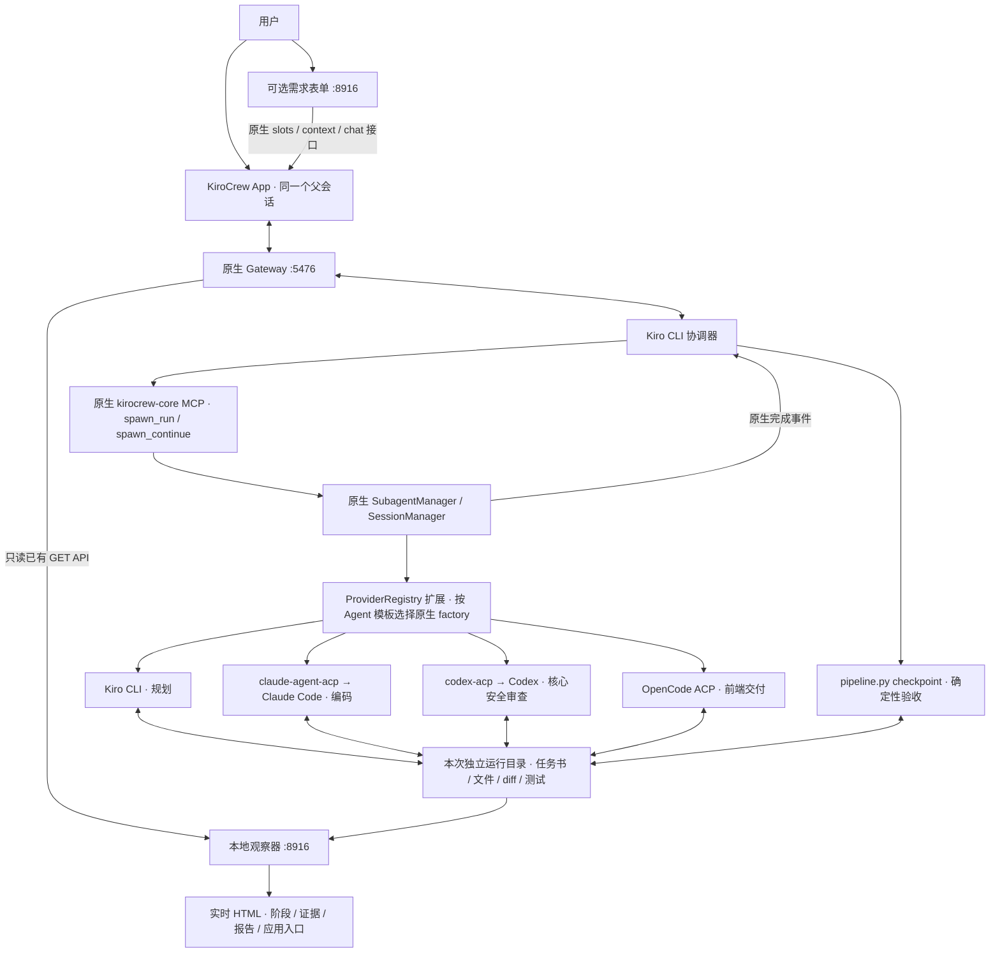
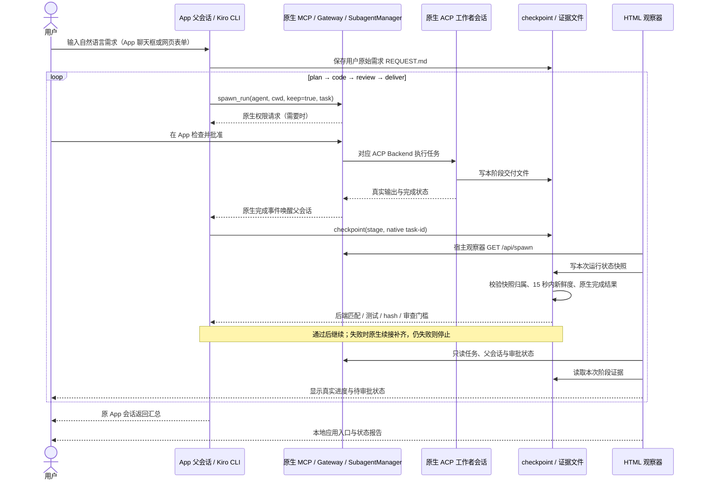

# KiroCrew App · 四工具交付 Pipeline

可配置工作流现位于 `Workflow Studio.command` / `8917`：支持自定义步骤、工具、模型与 Effort。
架构、三入口交互与版本规则见 [WORKFLOW-MVP.md](WORKFLOW-MVP.md)。下文保留固定四阶段 Pipeline。

入口是 KiroCrew App 的一条真实父会话。Kiro CLI 协调器通过原生 MCP `spawn_run`
串行分派四个工作者：Kiro CLI 规划 → Claude Code 核心编码 → Codex 安全与测试审查
→ OpenCode 制作并交付网页。完成事件回到原父会话，由父 Agent 继续下一步。

## 动手演示

1. 双击 **New Pipeline.command**，打开需求入口 `http://127.0.0.1:8916/`。
2. 填写自然语言开发需求，点击 **发送到 KiroCrew 并开始**；需求会作为普通用户消息进入
   一条新建的真实 App 会话。也可以点击 **在 App 中输入需求**，打开准备好的会话后直接聊天。
3. Kiro 自动生成规格、计划和验收测试；后续工具按这些文件执行。用户无需编辑 `plan.md` 或 `tasks`。
   原生审批出现时回 App 检查具体操作，再允许。
4. 打开 `http://127.0.0.1:8916/` 看真实阶段、任务 ID、实际后端、最近工具与阶段结果。
5. 交付后点击“打开交付的应用”，验证自己提出的产品功能。
   “查看状态报告”保留该次执行的结论及证据文件。

如果普通 Gateway 正占用 5476，启动器会明确报告，避免中断现有工作。先确认 App 没有正在执行的任务，
从菜单正常退出，再运行 PoC 启动器。使用原来的 `~/.kiro/crew`，不删除、迁移或重置历史 Sessions。

也可以手动执行：

```sh
python3 launch.py
python3 pipeline.py new
python3 pipeline.py serve
```

`new` 创建空会话并使用原生 `/context` 附加流程说明，不发送模型任务。
打开输出的 App 链接，直接输入需求即可。`serve` 提供需求入口和观察器；用页面的运行选择器查看历史。
每次任务保留独立目录与父会话。历史应用和报告使用 `/r/<run-id>/...` 路径，避免切换运行时混用文件。
重新启动看板不等于重新执行 Pipeline。旧固定用例仍可通过 `python3 pipeline.py new-demo` 生成。
新需求运行在 `manifest.json` 中标记为 `schema: 2`；旧固定演示是 `schema: 1`，历史交付物继续保留。

当前范围是**零依赖的本地 Web 小应用**，不是任意技术栈的通用开发平台。
框架保留四个阶段及文件布局，但核心导出函数、业务规则、验收测试和页面功能由用户需求决定。
涉及数据库、登录、远程服务或部署时，协调者应说明范围并等待用户调整，不能用假实现冒充完成。

## 用户输入如何进入框架

| 用户操作 | 使用的 KiroCrew 原生能力 | 本 PoC 的处理 |
|---|---|---|
| 在 App 中输入需求 | `POST /api/chat/slots`、`POST /api/chat/slots/{slot}/context`；App 原有聊天框 | 创建独立目录并附加流程说明；用户消息到达后，父 Agent 保存原始需求 |
| 网页填写后发送 | 上述两项，以及 `POST /api/chat?ws=1` | 提交原始需求作为普通用户消息；返回原生接收回执与 App 链接 |
| Kiro 规划 | 原生 `spawn_run(agent=poc-pipeline-plan)` | 生成 `SPEC.md`、`plan.md`、`tests/acceptance.test.mjs`，不要求用户编辑 |
| 交接到编码 | 原生完成事件、下一次 `spawn_run` | 规划验收锁定需求、规格、计划和测试哈希，后续修改会被拦截 |

`REQUEST.md` 保留用户原文；`TASK.md` 和 `tasks/*.txt` 是自动生成的阶段说明；
业务规格和测试由 Kiro 工作者生成。模型生成测试并不等于需求已被充分覆盖，
因此 Codex 还需要独立检查需求覆盖、边界和安全问题。

入口的 `/intake` 是本套 PoC 自带的本地表单适配器，不是新增的 KiroCrew 原生接口；
它不调用 Coding CLI、不调用 `spawn`、不管理阶段调度。客户无需自行开发该适配器。
发送回执只证明 Gateway 接收，最终完成必须查看阶段证据。
每次点击附带请求 ID，重复 HTTP 请求不重复发送；如果接收回执丢失，会标记“待确认”，
不自动重试。请打开对应 App 对话检查，避免重复启动。

## 架构图



## 交互流程图



## 阶段契约

| 阶段 | 模板 / 实际后端 | 输入 | 输出和验收 |
|---|---|---|---|
| 规划 | `poc-pipeline-plan` / Kiro CLI | REQUEST.md、TASK.md | SPEC.md、plan.md、验收测试；测试语法有效且在空基线上失败；锁定哈希 |
| 编码 | `poc-pipeline-code` / Claude Code | 需求、锁定的规格与测试 | core.mjs、真实 diff、测试通过、候选 SHA-256 |
| 审查 | `poc-pipeline-review` / Codex | 同一核心、diff、测试证据 | review.json / review.md；测试通过，无 high/critical；核心未变 |
| 交付 | `poc-pipeline-deliver` / OpenCode | 规划、通过的审查、已审查核心 | index.html / style.css / ui.mjs / delivery.md；核心、审查和测试保持一致 |

审核对象有明确版本：Codex 审查的是 Claude 生成的核心代码。OpenCode 在之后添加 UI，
所以不能说“最终全部代码都经过 Codex 审查”。浏览器功能与注入输入验证另存为 `browser-check.json`。
本例无网络部署，交付指更新本次本地 Web 目录并由临时服务器提供预览。

## 什么是原生能力，什么是 PoC

- **原生**：App 会话、Gateway、MCP、任务准入、审批、完成事件、Session 管理、ACP adapters、
  `ProviderRegistry.create_factory` 扩展接口，以及现有会话创建、背景上下文、聊天和任务/审批 GET API。
- **交付的 PoC**：`poc.py` 按固定 Agent 模板组合原生 factory；`pipeline_spec.py` 定义小型任务契约；
  `pipeline.py` 接收需求、准备会话、做确定性验收、生成报告和只读投影；`ui/live.*` 提供需求表单并展示数据。
- **调度者**是 App 父 Agent。Python helper 不循环启动 CLI，也没有新增调度 HTTP API。
  客户不需要开发接口，但需要使用这套预配置扩展。原版 App 单独启动不会自动加载此路由。
- 在已安装 **0.7.2** 上验证；0.7.1 为此前 PoC 的基线。后续版本先跑契约检查再声明兼容。

## Session 与上下文

父会话保持不变，每种工具有独立 Crew 子会话和原生工具 Session。任务书及阶段标记明确传入，
上一阶段的完整文件保存在同一运行目录；候选 hash 确认交接的是同一版本。
`keep=true` 支持续接；续接产生新任务 ID，但可能复用原 Crew / 工具 Session，
观察器通过原生持久化的 `conversation_key` 关联 factory 记录。
0.7.2 的任务列表在续接时可能返回空 `agent`；观察器核对该任务的原生持久化记录、
父会话及 `execution_context.template_id` 后补齐展示身份，并记录 `identity_source`，
不会根据任务文字猜测后端。

不复制全部父对话给每个模型。本例 `include_memory=false`，输入以可复查的契约和文件为准；
不宣称四个模型自动共享长期记忆。凭据仍由各 Coding Tool 管理。
观察器的本地鉴权只在宿主 Python 进程使用，不向 HTML 或 Coding Agent 暴露 token 或 secret。
Agent 内的 `checkpoint` 不调用 owner 鉴权接口，而是读取观察器写入的本次状态快照，
核验归属、连接状态和 15 秒内的新鲜度。观察器停用时验收失败，重新启动后可以重试。

## 状态为什么可信，以及局限

- “任务结束”显示为“等待阶段验收”；必须 native outcome 为 completed、父会话和模板匹配、
  实际 `provider.client.backend` 匹配，才能进入文件和测试检查。
- 原始需求、规划后锁定的规格/计划/验收测试、候选代码、diff、审查和交付文件均保留 hash。
  high/critical 或失败测试阻止交付验收。
- 网页断线保留最后记录并标明过期，不模拟继续执行、不虚构进度百分比。
- 审批同时读取 `/api/approvals` 和父会话未解决的 permission 记录；审批仍回原 App 处理。
- `checkpoint` 是流程门槛，不是独立安全沙箱。串行顺序由父 Agent 遵守任务契约；
  这不等于在 Gateway 内实现强制、事务式的生产工作流引擎。
  快照与门槛文件是本地 PoC 证据，不应视为能够抵御恶意本机用户修改的安全证明。
- Gateway 重启可能不再列出已结束的内存任务；已经落盘的 gate/report 是历史证据，
  缺失的运行中任务不会被假定为完成。未验收任务需要在 App 中检查或恢复。
- Web 服务只绑定 loopback、只提供白名单文件，不公开用户目录；不支持远程多人访问。
  需求入口使用 `127.0.0.1:8916`，生成的应用使用 `localhost:8916`，浏览器 origin 分离。
  表单提交必须来自入口 origin，使用 JSON 和自定义请求头；生成页面不能调用需求入口启动新任务。
  不把宿主 Gateway 凭据暴露给浏览器或 Agent。
- `/context` 是原生的待消费背景队列。准备空会话后若 Gateway 重启、背景丢失，应重新从入口准备一条新会话，
  不把未注入流程的普通聊天误称为 Pipeline。模型任务执行中不要重启 Gateway。

## 验证与代码入口

```sh
/Applications/KiroCrew.app/Contents/Resources/backend-dist/kirocrew-backend-arm64/bin/python3.12 -s -m unittest -v test_routing.py
python3 -m unittest -v test_pipeline.py
```

原演示 `report.html` 在原本机 PoC 作为历史回放保留，不在此公开仓库分发。实时页面是 `ui/live.html`，
每次运行的 `report.md`、`report.json`、`report.html` 是独立状态报告。
`gate-history.jsonl` 保留阶段验收尝试，避免只留下最后一次“通过”而丢掉失败原因。

## 本机实际验收 · 2026-10-08

运行：`pipeline-20261008-121533-86bf`，KiroCrew 0.7.2，原生 Gateway PID 32629。
四阶段均通过；原有 23 条 App 对话全部保留，加本次新对话共 24 条，配置文件字节未变。

| 阶段 | 实际任务 ID | 结果 |
|---|---|---|
| Kiro CLI 规划 | `6edf3e3c` | plan.md 已生成 |
| Claude Code 编码 | `5eb4043b` | 实现 core.mjs，8 项固定测试通过 |
| Codex 安全与测试 | `01bee1ee` | 核对真实 diff / 哈希，新增 6 项安全测试，14/14 通过，无 findings |
| OpenCode 交付 | `5b224176` → `f52c08ad` → `46080507` | 前两次交付不完整，原生续接两次补齐；最终验收通过 |

OpenCode 三个任务保留同一 Crew 会话 `subagent:5b224176` 和同一原生 Session
`ses_ee6359adcffetp6l81SyWibPFo`。验收使用最新任务 `46080507`。

宿主另行验证了示例去重、分类、清空、复制、HTML 注入输入、390px 手机布局；
无 JS 运行错误或外部网络请求。浏览器读取的文件哈希与最终交付文件一致。
框架测试 9 项、原生路由契约 4 项通过。

本轮遇到的问题和处理：

1. Agent 内 owner 鉴权被原生拒绝：验收改为读取宿主只读观察器的新鲜快照，没有绕过原生权限。
2. OpenCode 空返回 / 缺交付物：文件验收拦截，由父会话调用原生 `spawn_continue` 补齐。
3. 续接 `agent` 为空及 Conversation ID / Task ID 混淆：以原生持久化绑定核实身份，
   用最新 Task ID 验收，并加入模板说明和回归检查。
4. 文档错误地声称 ES modules 可以直接双击打开：原生 `spawn/steer` 接受了反馈，
   但未在任务结束前落实修改。因此由宿主校正启动说明，并保留原文、作者和哈希记录；
   未修改 OpenCode 的 Web 代码。API 返回“已接收”不等于修改已经完成。

完整核验在本机 `evidence/pipeline-verification.json`；报告、浏览器记录、原始文档及校正记录位于本次运行目录。
这是有操作人员处理权限请求并验证结果的 PoC，不宣称已经验证无人值守生产交付。
