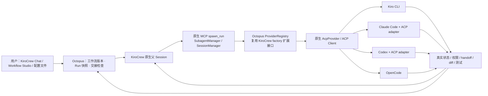

# KiroCrew Octopus

以 **KiroCrew 为入口、ACP Harness 为执行底座**的多 Coding Agent 工作流框架。
用户定义任务，再为每个任务选择 Coding Tool、Model 和 Effort；在原生 KiroCrew 对话中执行，
通过 Workflow Studio 跟踪进度、权限等待、交接证据与交付物。

**当前：本地 macOS PoC 基线。下一步：完成本地基础测试。**
EC2 目前只保留规划与设计；本地验证完成后，再决定是否开展云端实验。
EC2 自动部署、可靠后台调度、Dev Teams 多人协作和 GitHub / GitLab Connector 尚未实现。
本项目是 KiroCrew 的扩展项目，不是 KiroCrew 上游的官方 Enterprise 产品。

## 当前能做什么

- Kiro CLI 规划 → Claude Code 编码 → Codex 安全 / 测试审查 → OpenCode 前端交付。
- Web 向导、Chat、JSON / YAML / Markdown 三类工作流配置入口；支持 1–8 个顺序任务。
- 每个任务选择后端、模型、Effort；区分请求参数与原生实际报告，未报告的值不推测。
- Workflow 包含 Sessions，Session 包含 Tasks；编辑生成新版本，当前运行保持原快照。
- Session 导出、工作台归档 / 恢复，工作流可恢复删除，保留原生历史对话。
- 蓝白工作台、可调整侧栏、任务进度、状态报告与产物预览。
- Session 环形进度显示已核对阶段的百分比；仅运行中闪烁，支持减少动态效果设置。
- 失败或已交接阶段可单独重试；保留旧证据，使下游结论失效，在原 KiroCrew 会话续作并重新核对。
- 新增可移植三阶段配置：Kiro CLI 需求分析 → Codex 开发 → Claude Code 测试验证。
  见 [增强说明](docs/enhancement/CHANGES.md)；“Fabel 5.1”为未核实偏好，实际配置使用 `auto`。



共享的是工作流、工作目录和明确交接的文件；不同工具有各自的原生 Session 与认证。
ACP 驱动 Agent 会话，MCP 提供工具调用。工作台不绕过 KiroCrew 直接启动 Coding CLI。

## 从哪里开始

| 目的 | 文档 |
|---|---|
| 通过图表、动画和源码理解 MVP | [离线交互 HTML 报告](docs/workflow-mvp-report/index.html) |
| 下一阶段做什么、如何验收 | [迭代计划](PLAN.md) |
| 查看后续 EC2 部署设计 | [EC2-001 实验计划](docs/experiments/EC2-001.md) |
| 了解现有实现与公开基线 | [架构与验证边界](docs/BASELINE.md) |
| 设计 Dev Teams 平台 | [Enterprise 目标架构](docs/architecture/ENTERPRISE.md) |
| 连接 GitHub / GitLab | [Connector 设计](docs/architecture/CONNECTORS.md) |
| 使用与开发现有工作台 | [操作指南](docs/OPERATIONS.md) · [开发手册](docs/DEVELOPMENT-HANDBOOK.md) |
| 修改代码、运行测试 | [贡献指南](CONTRIBUTING.md) |

## 本地运行：现有 macOS 基线

前提：Apple Silicon macOS、已安装并初始化 KiroCrew 0.7.1 / 0.7.2、可用的 Node/npm，
以及已分别安装和登录的 Kiro CLI、Claude Code、Codex、OpenCode。
适配器版本由 `package-lock.json` 固定。Linux 适配是 EC2-001 的工作项，当前启动脚本不能直接用于 EC2。

```bash
git clone https://github.com/LiboMa/kirocrew-octopus.git
cd kirocrew-octopus
./setup.sh
./"Workflow Studio.command"
```

`setup.sh` 会先备份 KiroCrew 配置到本地 `backups/`，再调整 Session 分配策略和允许的实验目录；
启动时会准备专用 `poc-*` Agent 模板。已有 Gateway 占用端口时，启动器不会强制终止它。
当前开发机若已运行旧 PoC，请继续使用旧目录，另选空闲实验环境再启动这个 checkout。

打开 `http://127.0.0.1:8917/`，选择“新建工作流 → 实例模板 → Web 应用 · 四工具交付”，
先用自动模型完成一轮，再根据当前账号实际公布的能力指定 Model / Effort。
`workflows/development.json` 是保留的兼容性回归样例，内含原测试环境的明确模型 ID，
**不保证其他账号可用**。可移植的起点见 [四工具自动模型示例](examples/ec2-four-agent-auto.yaml)。

## 不调用模型的回归检查

使用 Python 3.12 / 3.13 的独立虚拟环境：

```bash
python3 -m venv .venv
source .venv/bin/activate
python -m pip install -r requirements-workflow.txt
python -m unittest test_workflow test_workflow_library test_pipeline test_reload_gateway -q
node --check ui/workflow.js
node --check ui/workflow-view.js
```

这些测试使用临时目录与模拟原生响应，不需要 KiroCrew 登录，也不执行真实 Coding 任务。
`test_routing.py` 是另行运行的原生契约检查，需要已安装的 KiroCrew 运行时与 ACP 适配器。

## 数据和发布范围

仓库只提交框架源码、模板、图表与文档。运行产物、Sessions、Memory、认证、
模型能力缓存、依赖目录和客户案例原始记录都留在部署环境中。
原始本机 PoC 与其历史数据继续保留；公开仓库是后续迭代入口。

上游及第三方依赖说明见 [第三方说明](docs/THIRD-PARTY-NOTICES.md)。
当前没有为本项目新增代码指定开源或商业许可证；Enterprise 是规划中的功能范围名称，
不能据此推定授权条款。
