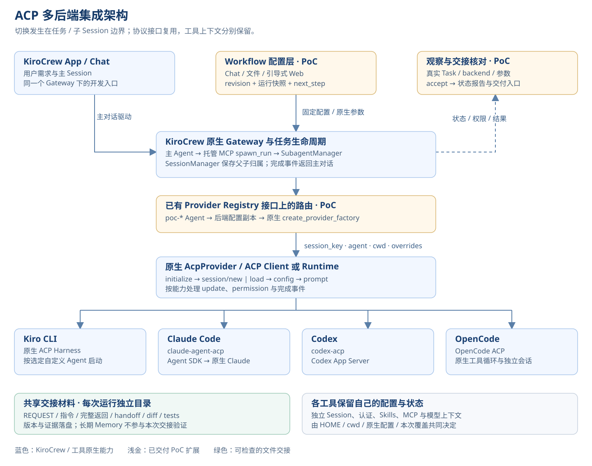
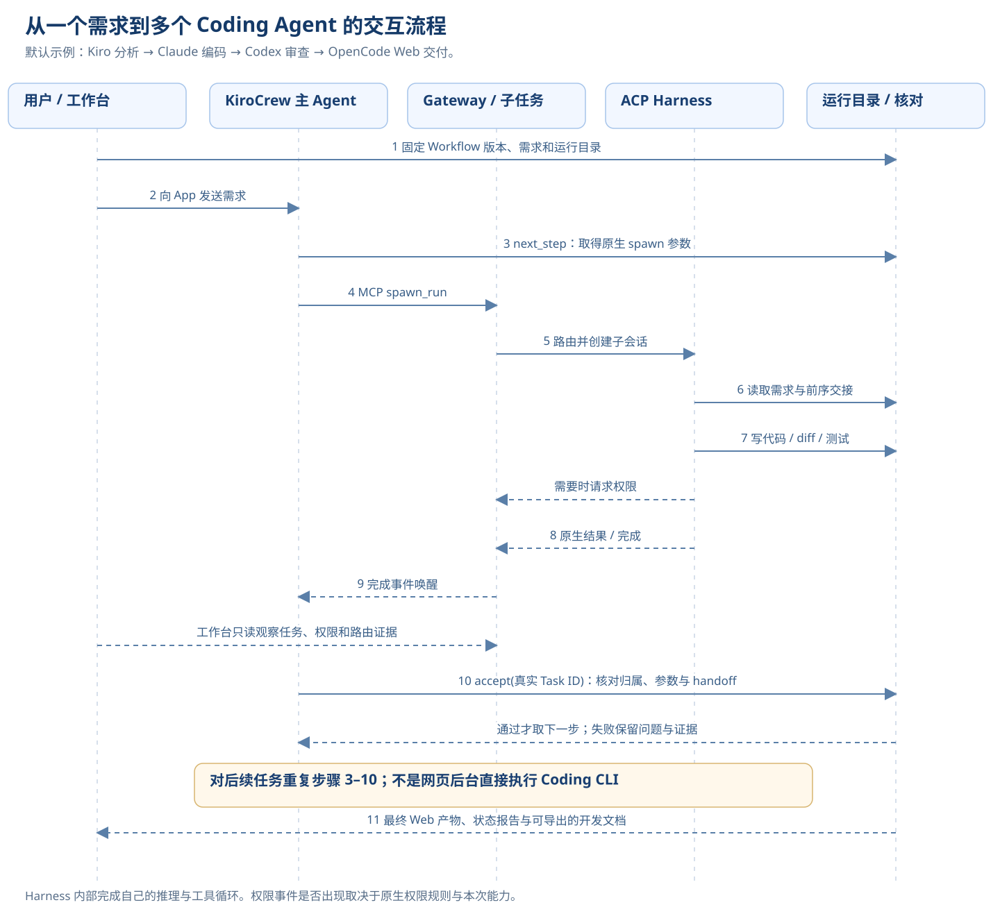
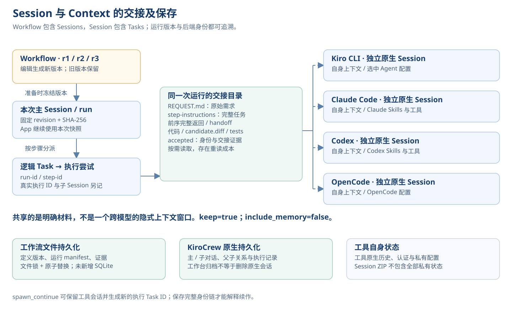

# 公开基线：当前架构与边界

日期：2026-10-08。来源：既有 `kirocrew-app-poc` 框架的源码与回归测试。
本仓库未导入本机 Sessions、Memory、凭据、原始日志或客户案例运行目录。

## 模块地图

| 文件 / 模块 | 作用 |
|---|---|
| `workflow.py` | 工作流校验、版本、Run 快照、原生对话创建、下一步参数、交接核对、状态投影与 HTTP |
| `workflow_library.py` | 生命周期、导入导出、归档、原生对话导出与意图生成 |
| `workflow_files.py` | JSON / YAML / Markdown 解析与序列化 |
| `poc.py` | 通过已有 `ProviderRegistry` 扩展接口组合多 ACP factory |
| `api.py` | 本机原生 Gateway 的认证与 API 访问 |
| `pipeline.py` / `pipeline_spec.py` | 原固定四阶段 Pipeline 与验收辅助；保留供回归和比较 |
| `workflow_launch.py` / `launch.py` / Shell | macOS 本地生命周期；EC2 阶段需要无桌面适配 |
| `ui/workflow*` | 引导配置、任务状态与工作流 / Session 导航 |
| `ui/crew-entry*` | 进入原生 KiroCrew 对话时的认证引导 |

## 架构图

这些图来自本地报告的结构部分；不是云部署、Enterprise 或自动化恢复已经完成的证明。

## 一次任务实际怎么走

1. 工作台 / 文件 / Chat 提供需求与 Workflow；保存校验后的新版本。
2. 新 Run 冻结版本，调用原生 `/api/chat/slots` 创建父对话并设置上下文，再发送用户需求。
3. 父 Agent 调用 `workflow.py next` 获取下一步的精确参数，经原生 MCP `spawn_run` 提交。
4. SubagentManager / SessionManager 管理原生任务；Octopus Registry 根据 `poc-*` 模板选择 factory。
5. 原生 AcpProvider / ACP Client 启动对应 Harness，协商、创建 / 恢复工具 Session、发送 Prompt。
6. 工具以自身认证调用模型，执行允许的工具操作；权限、状态和完成事件回到 KiroCrew。
7. `workflow.py accept` 核对身份、参数、结果与交接，父 Agent 再继续下一步。
8. Studio 读取真实状态与文件，提供报告 / 预览；浏览器动画不是模型完成百分比。

代码中没有通用的跨工具共享模型窗口。各工具有独立 Session，明确的 handoff 文件和同一候选目录
承担上下文传递。当前子任务 `keep=true`、`include_memory=false`，关闭跨后端共享 / warm pool。

## 已实现与未实现

| 已实现 | 未实现 / 不能承诺 |
|---|---|
| 顺序工作流 1–8 步，模型 / Effort 请求与实际证据分开 | 任意 DAG、分支、多 Worker 并行 |
| 版本冻结、唯一名称、工作台归档 / 恢复、原生 Layer A 导出 | 完整灾难恢复、共享个人工具私有上下文 |
| 基于原生完成事件的步骤推进 | 持久后台队列、未知派发自动协调、exactly-once 执行 |
| 文件锁、原子替换与不可变快照 | 跨文件事务、团队数据库 |
| 本机 owner 认证 | 多用户 SSO / Team RBAC / 租户隔离 |
| 当前 Mac 路径与运行时适配 | 可直接运行的 EC2 安装器 / Linux 服务文件 |
| 交接身份和参数核对 | 通用代码质量 / 安全 PASS 认证，交付修改后的自动再审查 |

模型 ID 和可用 Effort 由实际工具、账号、组织策略及适配器版本决定。
工作流回归 fixture 中的明确模型名只是历史测试输入，不能当作公开通用模型目录。

## 版本与验证

- 本地原生实测基线：KiroCrew App 0.7.2；PoC 的运行时版本检查允许 0.7.1 / 0.7.2。
- 本次架构查阅的上游源码 commit：`6287f540aef70e197657947e6530702ad74233f9`。
  App 版本、Python 包元数据、源码 commit 分别记录，不把三者假定为同一标识。
- npm 锁定：`@agentclientprotocol/claude-agent-acp` 0.84.0，
  `@agentclientprotocol/codex-acp` 1.11.0。原生四个 CLI 需在目标主机另行安装与验证。
- 公开基线回归入口：`python -m unittest test_workflow test_workflow_library test_pipeline test_reload_gateway -q`。
- `test_routing.py` 是需要原生运行时的单独契约验证，不计入无凭据 CI。

本机历史四后端交付属于此前 PoC 的实验结果。本次公开整理只重新验证框架回归与打包，
没有创建新的 Coding 任务，也未在 EC2 重跑。目标主机必须执行 EC2-001 才能获得云端实测结论。

本次 57 项回归与分发包检查结果见 [公开基线验证记录](PUBLICATION-VERIFICATION.md)。
