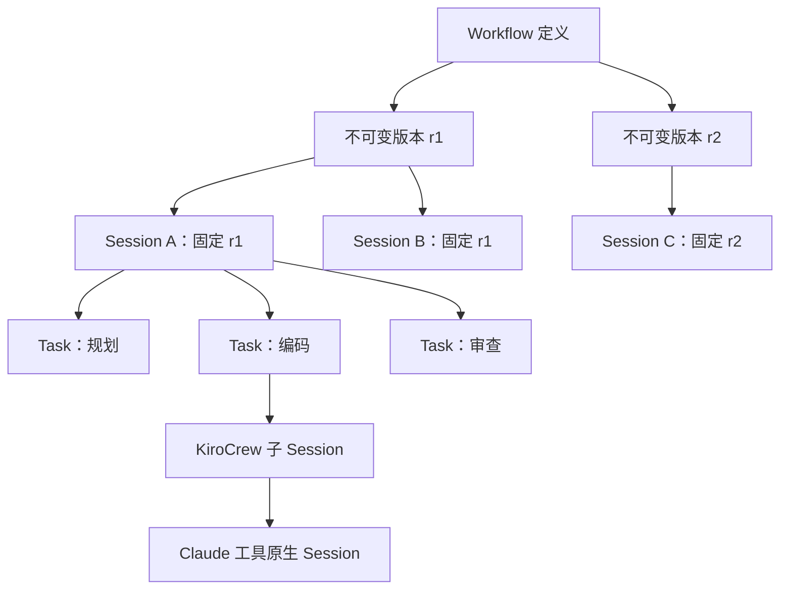
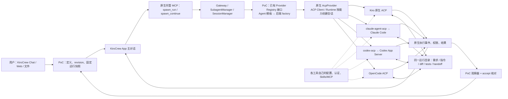
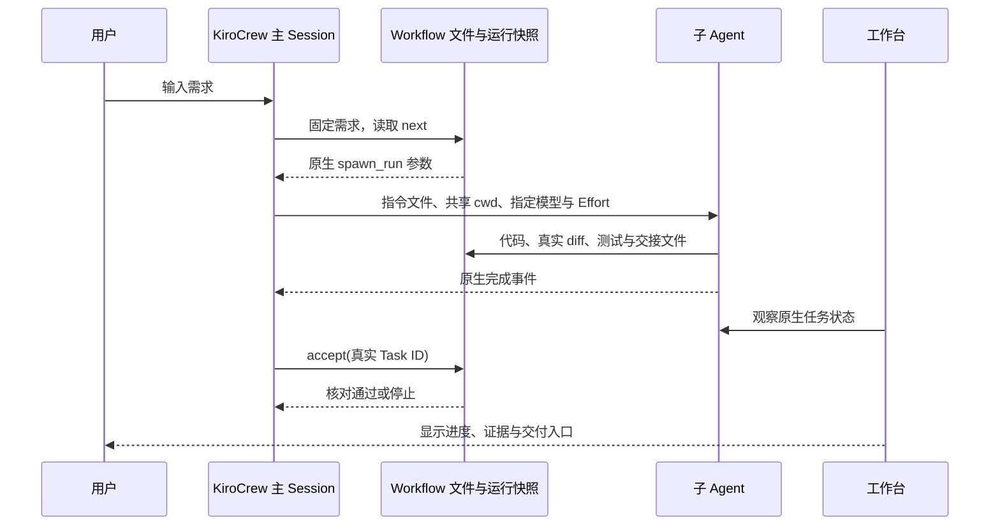

# KiroCrew 工作流开发手册

更新：2026-10-08。本文整理本次需求对话、现有 PoC 实现和已验证的调用机制。
这里的工作台是 KiroCrew 之上的 PoC 配置与观察层，不是 KiroCrew 上游发行版。
日常点击路径、状态颜色与拖拽快捷键见 [操作指南](OPERATIONS.md)。
公开架构见 [基线说明](BASELINE.md)，以 ACP 模块、流程和实现为主线。
EC2 和 Enterprise 的待实现部分见 [迭代计划](../PLAN.md)。

## 1. 产品目标

用户以 KiroCrew 为开发入口，通过 Chat 或 Web 定义需求和工作流。
每个任务独立选择 Coding Tool、模型和 Effort；开发进度、实际调用证据和交付物可以追踪。
用户不必手工编写 Plan.md、Tasks 或新的 ACP 接口。

默认演示流程：

1. Kiro CLI 分析与规划。
2. Claude Code 编码。
3. Codex 根据真实 diff 做安全与测试审查。
4. OpenCode 整理交付、更新 Web 前端。

这个顺序是模板，用户可以修改。首版支持 1–8 个顺序任务。Gemini CLI 不在候选中。

## 2. 工作流、Session、Task 的关系



- **Workflow ID**：可重复使用的流程定义身份。
- **版本号**：一次保存生成的版本；运行快照记录版本与 SHA256。
- **Session ID**：一次开发运行对应的 KiroCrew App 主对话。
- **Task ID**：运行内的任务身份，显示为 `Session ID/步骤 ID`，不同运行不会混淆。
- **原生执行 Task ID**：`spawn_run` 返回的执行尝试 ID。续作可能产生新的执行 ID。
- **工具 Session ID**：Claude、Codex 等自己的会话 ID，与 KiroCrew Session 不同。

步骤 ID 在一个工作流内唯一；复制或导入的不同工作流可以使用相同的步骤名称和步骤 ID。
完整身份由上层 Workflow 或 Session 限定。新建 Session 使用时间戳与完整 UUID。

配置修改统一用于下一次运行。当前 Session 的任务列表、模型、Effort 和快照不会被重写。

## 3. 从界面开始

工作台默认地址：`http://127.0.0.1:8917/`。
运行 `Workflow Studio.command` 可通过现有启动器打开工作台。

### 构建与编辑

向导分为三步：

1. **目标**：选模板、输入开发需求，或描述工作流意图。
2. **任务与 Agent**：先填写 Task ID、名称、说明，再选择工具、模型、Effort。可以排序、添加和移除任务。
3. **确认**：检查流程；仅保存，或保存并开始。也可先建立 KiroCrew 对话，再从 Chat 输入需求。

向导可以收起到左侧，通过“编辑工作流”返回。浏览器保留未保存草稿。
切换 Session 时，任务视图跟随所属工作流；历史 Session 仍展示自己的固定版本。

### Session 管理

左侧按“工作流包含 Session”显示，工作流可折叠。平时点击 Session 查看任务；
点击左栏“管理”才出现勾选与批量操作。单个 Session 的操作集中在中间工具栏“Session 操作”。
“＋ 新 Session”基于所属工作流填写新需求，在确认开始后创建独立运行。

- **导出**：最多选择 20 个 Session，打包对话、配置、开发记录和文档。
- **归档**：把 Session 移入工作台的“归档”视图。
- **恢复**：在归档视图勾选已归档 Session，点击恢复。

归档是 PoC 的可恢复管理标记，不会关闭或删除 KiroCrew 原对话，也不会停止运行中的任务。
删除工作流同样保留版本和 Session；从“归档”打开该工作流，可恢复或复制。
被删除的工作流不能直接保存新版本或建立新运行，恢复后可继续使用。

### Task、报告与拖拽

右侧 Task 只显示序号、名称、工具与状态；点击后在中间查看详情、复制完整 ID、
查看执行记录或编辑下一版。当前运行固定原配置。

状态报告与原始 JSON 并存。报告按已交接、执行中、待处理、待执行分类，
颜色区分成功、运行、等待和失败；真实状态变化才触发短暂高亮。
运行段动画不增加完成百分比，断连或快照超时后停止；支持系统减少动态效果设置。
缺少原生耗时证据时明确显示未报告。

左右分隔线支持拖拽、方向键微调、双击复位，宽度保存到本浏览器。
小屏使用滑出侧栏，不挤压主内容。

## 4. 文件导入、导出

支持 JSON、YAML、Markdown。Markdown 中需要一个完整的 `yaml` 或 `json` 工作流代码块。
导入会分配新的 Workflow ID，进入未保存草稿。名称冲突时建议数字后缀，保存时再次校验。
导出包含当前编辑配置；运行 Session 导出的配置则是当次固定版本。

```yaml
schema: 1
id: example-workflow
name: 编码与独立审查
revision: 0
steps:
  - id: code
    name: 实现需求
    tool: claude
    model: auto
    effort: ""
    prompt: 根据用户需求实现最小版本，执行验证并记录真实结果。
  - id: review
    name: 安全与测试审查
    tool: codex
    model: auto
    effort: ""
    prompt: 阅读真实 diff，执行测试，记录问题与验证范围。
```

命令行：

```bash
python3 workflow.py export development --format yaml
python3 workflow.py export development --format markdown
python3 workflow.py import example.yaml
python3 workflow.py save draft.yaml --expected-revision 0
```

`import` 输出带新 ID 的草稿，不自动保存。`save` 是显式写入操作，仍要求版本号匹配。
YAML 使用 PyYAML 安全解析，拒绝自定义对象、重复字段及锚点引用。
本机可复用 KiroCrew 随包的 PyYAML；其他环境安装 `requirements-workflow.txt`。

## 5. 根据意图生成工作流

例如输入：

> 先由 Kiro 规划；Claude 编写页面；Codex 只审查真实变更和测试；OpenCode 整理交付页面。

点击“生成工作流草稿”后，工作台：

1. 使用 KiroCrew 原生 `/api/chat/slots` 创建独立的生成对话。
2. 使用 `/api/chat?ws=1` 发送设计请求，由现有 `poc-kiro` Agent 处理。
3. Agent 直接在原生对话中返回 JSON，不要求目录读取或写文件。
4. 工作台通过原生对话接口读取回复，校验结构、Task ID、工具与参数，再保存到生成目录。
5. 用户点击“采用生成的草稿”，检查和编辑后保存。

生成对话只设计流程，不执行实际开发；不自动启动生成的任务。
默认草稿使用 `model: auto` 和空 Effort，具体模型需要用户检查。
生成过程需要授权时，通过“在 KiroCrew 查看生成过程”进入原生对话处理。
失败或文件无效会显示真实错误，不用固定模板冒充生成结果。

## 6. 实际调度架构



可导出的矢量图：[架构](architecture/baseline/architecture.svg)、
[交互时序](architecture/baseline/interaction.svg)、
[Session 与 Context](architecture/baseline/context.svg)。

工作台不是另一个直接运行 Coding CLI 的调度器。
`workflow.py next` 输出原生 `spawn_run` 参数，KiroCrew 主对话按参数调用。
`poc.py` 在已有 Factory 边界将 `poc-kiro / poc-claude / poc-codex / poc-opencode`
映射到正确后端。各工具继续使用自己的登录、认证和权限机制。

这仍然包含 PoC 的配置、路由及观察代码，不能描述为完全无需该层的上游原生 Workflow 产品。

## 7. 上下文与交接



主 Session 与工具原生 Session 不是同一个对象。子任务按需读取 `REQUEST.md`、
任务指令、前序完整返回和交接文件，不共享所有模型的隐式上下文窗口。
当前工作流调用明确使用 `include_memory: false`，不依赖长期 Memory 召回完成交接。
文件交接可检查、可保存，但仍有重新阅读成本，长输出和遗漏说明也会降低效率。

## 8. 模型与 Effort：请求不等于实际生效

- Claude 候选来自 ACP 会话公布结果和 `provider_models.json` 缓存。
- 明确选择的 Claude 模型不在当前候选中时，PoC 阻止开始。
- Codex 当前 PoC 候选包含运行观察值，尚未完整接通动态目录和逐模型 Effort 筛选。
- Codex 的公开配置将 Model / Effort 分开；Factory 内部编码模型与 Effort，原生 ACP 客户端拆分设置。
- 未报告的实际 Effort 显示“未报告”，不把请求值伪装成实际值。
- 测试通过，但实际模型与配置不符时，显示“交接未通过”，不冒称工具执行失败。

完整 Codex 目录来自 Codex App Server 的 `model/list`，由现有 Codex ACP 转换并公布。
动态目录补全属于后续工作。Token 用量同样只能展示后端实际报告的数据，不能保证所有工具都返回。

## 9. 导出的开发文档

每个 Session 的 ZIP 子目录包含：

- `session.kcsession.json.gz`：KiroCrew 原生导出，默认 Layer A，不主动请求工具私有 Layer B。
- `workflow.yaml`、`workflow.md`：本次固定的工作流版本。
- `report.json`：任务和核对证据快照。
- `conversation.md`：原生导出所含对话。
- `development-manual.md`：需求、任务、配置、结果及重现说明。
- `release-notes.md`：按实际交接状态生成的 Release 候选记录。
- `features.json`：原生导出中的用户输入及其消息位置。

这些是可追溯的文档整理，不代表已发布或完成生产安全验收。
`features.json` 保留用户输入，不把未完成需求标为已实现。
本次产品设计对话的人工整理另存于 `FEATURES-AND-DECISIONS.md`。

## 10. 开发入口与边界

| 文件 | 职责 |
|---|---|
| `workflow.py` | 版本、运行快照、原生调度参数、观察与 HTTP API |
| `workflow_library.py` | 工作流生命周期、Session 归档、原生导出与意图生成 |
| `workflow_files.py` | JSON / YAML / Markdown 安全解析及序列化 |
| `poc.py` | 已有 Provider Factory 上的多 ACP 路由 |
| `api.py` | 本机原生 Gateway 认证与访问 |
| `ui/workflow.*` | 工作流树、开发进度、合并编辑向导 |
| `ui/workflow-view.*` | 可拖拽布局、动态报告、状态反馈；不执行 Coding 任务 |
| `ui/crew-entry.*` | 进入 KiroCrew 时通过原生接口完成认证 |

运行测试：

```bash
python3 -m unittest test_workflow test_workflow_library test_pipeline test_reload_gateway -q
node --check ui/workflow.js
node --check ui/workflow-view.js
```

本轮没有迁移或删除历史 Session，也没有修改 KiroCrew 上游源文件。
旧 Kiro CLI PoC 和原 Pipeline 继续保留。

## 11. 名称一致性与持久化决策

本次没有引入 SQLite。现有工作流版本文件是权威数据，保存通过同一文件锁串行化，
覆盖 Web API、Chat 通过 CLI 修改以及文件保存。名称唯一性也放在该锁内。

名称使用 Unicode NFKC、空白合并和 casefold 比较，禁止不可见控制字符。
不同 Workflow ID 不得占用相同最新名称；已删除工作流也保留名称。
复制、导入、模板和生成草稿先建议可用名称；提示不替代保存时检查。
原工作流正常增加版本，历史 Session 和不可变快照保持原内容。

规模评估时有 4 个已保存工作流、19 份版本及运行快照，没有需要迁移的重名项。
当前需求不需要额外建立数据库和迁移路径。文件写入锁与原子替换不构成跨文件事务；
Session 导出也不替代完整代码、KiroCrew 数据和工具私有状态的备份。

当需要大量元数据检索、多用户写入或跨多项元数据原子更新时，再评估 SQLite 元数据层，
继续保留现有文件快照和可移植导出能力。

## 12. ACP Harness 的模块与接入实现

本 PoC 的后端选择粒度是任务 / 子 Session。共享 Provider 和 ACP 接口，不共享不同工具的
活跃原生会话，也没有按单次文件或 Shell 工具调用切换 Coding Agent。

| 模块 | 代码入口 | 职责 |
|---|---|---|
| 启动组合 | `poc.py:main` | `boot_platform` 后通过 `dataclasses.replace` 注入 Registry，实现已有扩展契约 |
| 路由 | `PocProviderRegistry.create_factory` | 为各后端准备配置副本，按 poc-* 模板选择 factory；校验实际 backend |
| 原生工厂 | `config/loader.py:KiroCrewConfig.create_provider_factory` | 使用 session、cwd、model/effort override 构建 AcpProvider |
| 任务生命周期 | `SubagentManager`、`subagent_manager/run.py` | 准入、执行、Crew Session 与完成事件 |
| 会话传输 | `AcpProvider.start`、`AcpRuntime`、`AcpClient` | 按后端能力启动、协商、创建/恢复和执行会话 |
| 配置投射 | `providers/mirrors/*` | 后端适用的配置、MCP 与权限映射；不能假定字段一一等价 |
| 核对 | `workflow.py:_accept` | 真实 Task/父会话、backend、原生参数、返回与 handoff 的一致性 |

ACP 的通用阶段是 `initialize → session/new|load → 配置 → session/prompt → update/权限/完成`。
Kiro 默认通过原生 AcpRuntime 路径；其他后端按原生能力路径处理。目标 Coding Agent 在内部
进行推理和工具循环。MCP 是工具通道，此处父 Agent 通过 MCP 的 spawn_run 请求调度；
ACP 是 KiroCrew 驱动子 Agent 会话的协议。

Claude 经 `claude-agent-acp` 和 Agent SDK 使用原生 Claude；Codex 经 `codex-acp` 启动
Codex App Server；Kiro 和 OpenCode 使用其 ACP 接入。工具继续使用自己的 Provider 认证。

Codex 明确模型与 Effort 在原生公开参数校验后，于 factory 边界转换成内部组合 ID，
再由已有 ACP 配置处理。本机有 low Effort 的原生 turn_context 证据；其他工具未报告的
实际 Effort 不可用请求值补齐。

## 13. 原生 Tools、Skills 与 MCP 的加载边界

加载由原生工具、HOME / cwd、所选 Agent、本次覆盖与权限共同决定，不是完整复制终端环境。

- Claude 适配器明确启用 user/project/local settingSources，并使用本次 cwd。
- Codex 适配器启动原生 App Server，按 cwd 调用 skills/list 刷新技能。
- Kiro 自定义 Agent 根据 skill:// resources 映射技能。本版本 Crew 还准备受管理的原生 Agent
  副本，以受限技能目录和 skill_search 控制发现成本，原映射继续决定范围。
- 当前 poc-kiro / poc-claude / poc-codex 的 resources 为空。自定义 Agent 无映射时不注入
  Crew 技能目录；includeCrewContext=true 不是全量技能开关。Claude/Codex 的原生发现另行生效。
- mcpServers={} 和 includeMcpJson=false 描述 Crew/Kiro 模板，不代表 Claude/Codex
  原生配置中的 MCP 全部被禁用。投射、重名、认证、权限与适配器支持需要分别核对。
- 原业务项目的技能不会因为“在同一台机器”就自动进入 PoC 独立 workspace。

记录应区分发现、读取/注入和实际执行。此次完成源码与配置核对，没有新增统一能力配置界面，
也没有逐一触发所有本机技能验证。技能说明不会自动提供其依赖的程序、MCP 或凭据。
