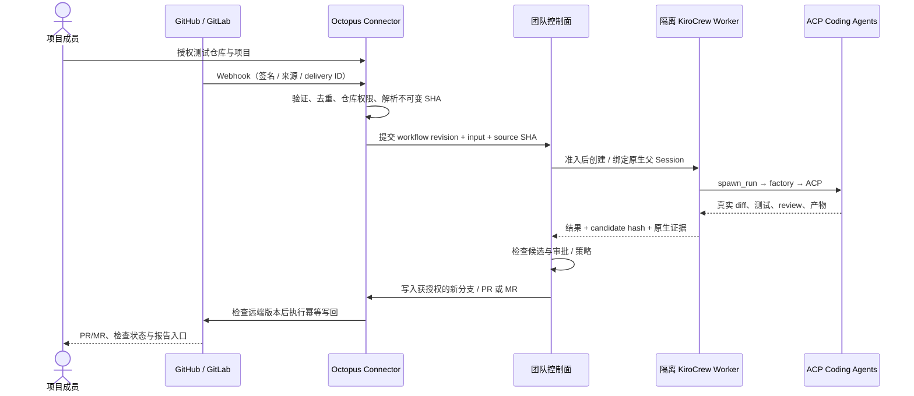

# GitHub / GitLab Connector 设计

状态：规划。当前代码尚没有仓库 Connector；`PublishRegistry` 的产物发布能力
不等于已经拥有 GitHub / GitLab 的分支、Webhook、PR / MR 生命周期。

## 共同流程

手动需求和 Webhook 需求使用同一 Run 准入契约。
仓库中的文本、Issue 或 PR 内容是任务数据，不得改变组织凭据和权限策略。

## 两个平台的差异

| 方面 | GitHub | GitLab |
|---|---|---|
| 推荐授权起点 | GitHub App，安装到选定组织 / 仓库 | 根据托管版本和组织策略选 OAuth 应用或专用项目 / 组自动化身份 |
| 权限 | 按 installation、repository、API permission 收窄 | 明确实例 URL、项目范围、scope、bot 身份与支持的部署版本 |
| 服务端凭据 | App 私钥保存在密钥服务，运行时获取 installation access token | 客户端 secret / refresh token 或受限 bot token 保存在密钥服务；支持过期、轮换、撤销 |
| Webhook 校验 | 原始 body + `X-Hub-Signature-256` 的 HMAC-SHA256 | 新版本优先 signing token / Standard Webhooks；旧版本按能力兼容 `X-Gitlab-Token`，不混为同一校验 |
| 幂等标识 | 平台、installation、delivery ID、事件动作与 source SHA | 平台、实例、项目、delivery / webhook ID、事件与 source SHA |
| 交付 | 新分支、commit、PR、Checks / 状态 | 新分支、commit、MR、pipeline / commit 状态 |

GitLab 当前文档说明 signing token 在 19.0 引入、19.1 去除 feature flag；
它使用 `webhook-id`、`webhook-timestamp`、`webhook-signature`，并对消息 ID、时间戳和原始 body 签名。
因此自建 GitLab 必须记录版本 / 能力，不能假定所有安装都支持新签名方式。[S5](../SOURCES.md#s5)

GitHub installation token 权限不能超过 App 安装授权，可进一步限制仓库与权限；
使用返回的 `expires_at` 管理刷新，不在业务逻辑中依赖硬编码寿命。[S3](../SOURCES.md#s3)
Webhook 签名验证依据官方算法，验证原始请求体且使用常量时间比较。[S4](../SOURCES.md#s4)
GitLab OAuth 应用支持不同所有权范围，最终授权方案须按目标实例确认。[S6](../SOURCES.md#s6)

## Connector 内部契约（待实现）

这是一层仓库业务适配，不是新增 Coding Agent 接口，也不替换 ACP：

| 操作 | 输入 / 输出边界 |
|---|---|
| `authorize_repository` | 成员身份、project、connection、repo → 可信授权范围 |
| `resolve_revision` | repo + ref → 不可变 commit SHA；后续不再依赖可移动分支名 |
| `materialize_workspace` | repo + SHA + Run → 独立工作区、来源清单；凭据不写入 Prompt 或公开 remote URL |
| `verify_webhook` | 原始 body + headers → 已校验的标准事件；无效请求不创建 Run |
| `publish_candidate` | 已批准 candidate hash + base SHA + Run → 分支 / commit / PR 或 MR |
| `update_check` | Run / Task + 真实验证结果 → 对应提交的状态；禁止给其他 SHA 标 PASS |
| `revoke_connection` | connection → 撤销、拒绝后续派发 / 写回、审计 |

事件数据保存必要字段：租户 / 项目 / 连接 / 仓库、source SHA、事件 ID、请求身份、
workflow revision、request_id。原始 webhook 中的敏感字段按策略裁剪。

## 写回和代码安全

- 第一版只操作显式选定的测试仓库；默认建新分支与 PR / MR，不自动合并主分支。
- Reviewer 看到的 diff、测试报告与最终候选必须对应同一版本；后续交付修改会使旧 review 失效。
- 写回前检查 base / head 是否变化；变化时产生冲突状态，重新验证，不强推覆盖。
- 重试使用稳定的 Run 标识查找已有分支 / PR / MR；远端写入成功但回执丢失时先查询再重试。
- Webhook 重放、时间窗、乱序、递归触发和速率限制都需要明确处理。
- 对 fork PR 和不受信任代码隔离执行，不向其工作区下发 Connector 私钥 / token；
  代码写回由受控服务完成。Agent 不自行读取密钥并任意推送。
- 自建 GitLab URL 在管理员允许范围内；避免通过仓库地址访问任意内部服务。

## 逐步交付与验收

1. **CONN-01 只读**：列出授权仓库、固定 SHA、创建工作区；验证撤权与越界访问。
2. **CONN-02 事件**：验证签名 / secret、去重、标准事件映射；同一个事件只创建一个 Run。
3. **CONN-03 草稿交付**：写入新分支，创建草稿 PR / MR，关联真实报告；模拟回执丢失不重复创建。
4. **CONN-04 状态与审计**：测试结果对应 commit SHA，失效 review 不允许写回；配置撤权立即生效。
5. **CONN-05 双平台闭环**：分别在 GitHub 和目标 GitLab 测试仓库实际验证，保留脱敏记录。

自动合并、组织级大规模安装、任意自建版本兼容不属于首个 Connector MVP。
