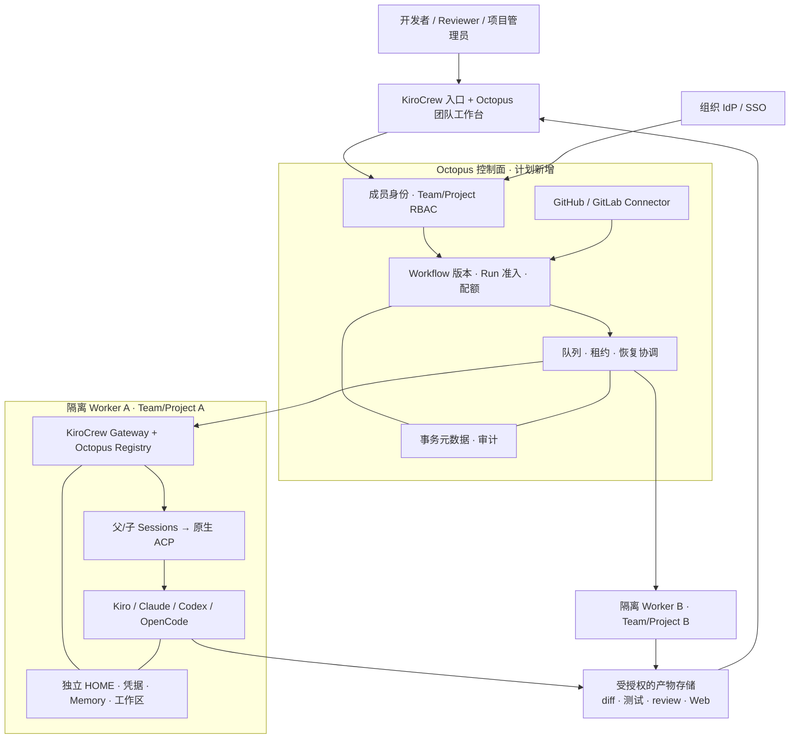

# Dev Teams：Enterprise 目标架构

状态：规划，尚未实现。Enterprise 指 Octopus 的团队功能范围，不是上游 KiroCrew 的授权或产品承诺。
现有基线见 [BASELINE](../BASELINE.md)；实施顺序见 [PLAN](../../PLAN.md)。

## 保留 ACP 底座，增加团队控制面

初版同一项目内串行执行、不同项目分配独立 Worker，再逐步扩展并行。
隔离强度按威胁模型选择 OS 账号 / 容器 / 实例；对互不信任团队不能只靠不同 cwd。
Worker 继续提供原生 KiroCrew 功能；控制面负责可信身份、授权和调度。

## 原生扩展接口能复用到哪里

依据固定源码版本的 `platform/interfaces.py`：[S1](../SOURCES.md#s1)。

| 接口 / 模块 | 当前用途与限制 | Octopus 计划 |
|---|---|---|
| `ProviderRegistry.create_factory` | 已接入 factory 创建链；本 PoC 已使用 | 保留每 Task / 子 Session 的 ACP 后端路由 |
| 原生 `spawn_run` / SubagentManager | 任务准入、执行、状态、完成事件 | 保留执行引擎；外层增加队列、租约与恢复 |
| `IdentityProvider.status` / preflight | 适用于状态展示、启动检查与凭据轮换 | 可承接组织身份集成的一部分；服务端授权仍需明确实现 |
| `IdentityProvider.whoami/issuer` | 源码标明 RESERVED，核心未消费 | 不能靠实现这两个函数就声称有多人 RBAC |
| `AgentIdentityProvider` | 工作负载身份及 token vending，区别于操作员 SSO | 按实际部署需要接入 Worker 身份，不替代成员权限 |
| 原生治理 / 隔离契约 | 限制能力与执行边界的既有位置 | 做契约检查后组合，不能以扩展为由放宽已有安全底线 |
| `PublishRegistry` | 发布“产物”的注册接口 | 可评估报告 / 产物发布；Git 分支、PR/MR、Webhook 是另一套语义 |

KiroCrew 现有接口是可用的扩展底座，不意味着团队域模型、SSO 授权和 Connector 已经完成。
不为 Coding Agent 重新发明传输协议；团队控制面与仓库服务是 Octopus 新增的产品模块。

## 身份和权限模型

关系：Organization → Team → Project → Workflow → WorkflowVersion → Run → TaskAttempt。
原生 Crew / 工具 Session ID 是 Run 的关联标识，不能单独当作访问权限凭证。

建议角色：组织管理员管理成员 / 集成；项目管理员管理流程和运行策略；
开发者创建需求 / 运行；Reviewer 批准交付；观察者只读授权项目。
每个 API、实时事件订阅、搜索、导出和产物下载都需要服务端项目权限检查。
不能只隐藏侧栏或使用不可猜测 ID。

同项目用户共同编辑工作流，使用 expected revision 检查冲突；每次运行冻结版本。
审批记录绑定发起人、批准人、动作、目标候选 hash 和当时策略。
成员撤权后失去后续数据访问；正在运行任务按项目策略取消或由授权管理员接管，留下审计。

现有 `api.py` 的本机 owner token 只适合可信主机内使用。
Enterprise 层不能把同一个 owner cookie 发给全部用户，再依靠前端做隔离。
团队 SSO 与工具自身的模型服务授权分别管理。

## Context 与长期记忆

共享层次：

1. 项目级：仓库、工程规范、批准的技能 / MCP、可共享知识。
2. Run 级：用户输入、冻结工作流、固定 source SHA、计划、候选和产物。
3. TaskAttempt 级：具体任务、必要前置输出、允许目录、验收标准。
4. 私有层：工具原生 Session、个人认证、未授权聊天与 Memory，默认不共享。

Handoff manifest 建议记录文件相对路径、hash、生产 Task、候选版本及访问级别。
下游从受控工作区读取内容，避免把完整聊天反复塞进 Prompt。
Context 大小有预算；压缩摘要保留来源引用，关键验收和代码证据不只保留摘要。

以后如启用团队 Memory，必须按项目 / 主体划分存储和检索权限，同时支持来源、失效、
删除与审计。向量相似度不是权限系统；不能先全库召回再由模型决定哪些可以看。
本基线 `include_memory=false`，没有实现团队 Memory。

## 数据与可靠性

| 数据 | 单机自动调度阶段 | 多人阶段建议 |
|---|---|---|
| Workflow / Run / Attempt / 租约 | SQLite 事务元数据，迁移现有索引 | PostgreSQL；应用层和数据库层的项目范围一致 |
| 不可变版本与产物 | 本地文件 / 加密 EBS + 备份清单 | 版本化对象存储，按项目授权、保留与审计 |
| Crew 原生数据 | 各 Worker 自己管理 | 不共享可写原生数据库文件；通过已验证 API 访问 |
| 工具认证 / Connector 凭据 | 主机侧专用配置 | 服务端密钥管理、短期权限、轮换与撤销 |
| 审计事件 | 独立事件表 | 可追溯身份、动作、对象和结果；不记录 token / 原始敏感 Prompt |

先持久化准入请求，再派发；完成时关联原生任务证据。
失败恢复以实际原生状态为准；不能保证跨进程 / 网络的 exactly-once 执行时，
通过幂等键、去重、协调和人工处理未知状态控制副作用。

## Dev Teams MVP 验收

- 两位成员可以协作管理同一项目，但同时保存产生明确版本冲突。
- A 项目无法通过 API、事件、搜索、导出或 URL 获取 B 项目的数据。
- 各 Worker 的 HOME、工具凭据、原生 Memory、工作目录按隔离边界分开。
- 工作流修改只影响新运行；取消、重试、接管与交付审批都有审计。
- 配额按团队计算并可限制并发；没有原生用量证据时显示未知值。
- 控制面重启和 Worker 离线都不把未知任务标成完成，不重复写回代码仓库。

高可用、多区域、任意 DAG 和团队共享 Memory 不列入首个团队 MVP。
