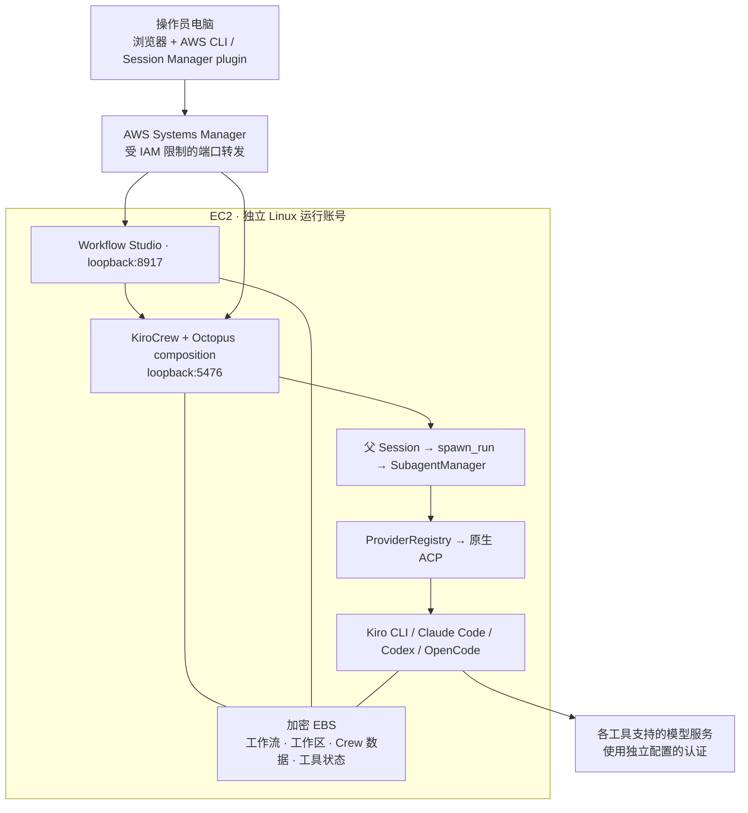

# EC2-001：KiroCrew Octopus 单机实验

状态：仅规划 / Design，尚未执行。日期：2026-10-08。
先完成 [P0.1 本地基础测试](../../PLAN.md#p01本地基础测试先行)，再决定是否开展本实验。
本文件描述未来步骤，不代表当前开始移植、部署或创建云资源。

## 实验问题

把已验证的本地调用链放到一台 EC2 后，能否通过浏览器进入 KiroCrew，
由同一个父 Session 串行驱动 Kiro CLI、Claude Code、Codex、OpenCode，
并在 Workflow Studio 查看真实状态、权限请求与产物？

第一轮只允许一个受信任操作员、一个在途 Run。远程访问能力不等于多人权限隔离。
原生 KiroCrew 支持 Linux 无桌面使用；Octopus 的现有启动器仍需移植。[上游安装说明](../SOURCES.md#s1)

## 部署图：拟采用



允许必要的出站连接：安装源、模型服务、SSM 等；逐项明确。
安全组不对公网开放 5476 / 8917。SSM 依赖正确的实例角色、Agent 和服务连通性，
没有公网出口时需另行配置所需 VPC endpoints 或代理。

## 建议参数与待填项

| 参数 | 首轮建议 / 约束 |
|---|---|
| AWS 账号、区域 | 执行前填入专用测试账号与区域；不默认沿用操作者当前 AWS profile |
| 操作系统 | Ubuntu 22.04 LTS x86_64 作为初始候选，记录具体 AMI ID；其他发行版另做兼容性检查 |
| 资源 | 4 vCPU / 16 GiB、100 GiB 加密 EBS 作为测量起点，**不是已验证最低要求或性能承诺** |
| 架构 | 首先 x86_64，减少同时验证架构差异；Arm 后续独立验证 |
| 运行身份 | 专用 `octopus` OS 用户；实例角色只用于本实验所需 AWS 能力 |
| 访问 | 两个 SSM 本地端口转发；Gateway / Studio 保持 loopback |
| 数据位置 | 建议 `/var/lib/kirocrew-octopus/`；实际路径适配后才能生效 |
| 预算与保留 | 执行前填写预算、结束时间、日志 / 数据保留期；停机后 EBS 等仍可能计费 |
| 版本 | 固定 KiroCrew 版本与工件校验值、四个工具版本、两个 npm adapter 版本、Octopus commit |
| 凭据 | 在新主机按各工具支持方式单独登录 / 配置；不复制个人电脑的全部 HOME |

## 第一步：先完成 Linux 适配

当前文件中的差异是实际待办，不可用“EC2 运行一个 Python 服务”略过：

| 当前实现 | 必须完成的变更 |
|---|---|
| `poc.py` 的 `/Applications/...`、Mac 解释器、HOME 推导 | 单一运行时配置，工具发现、解释器与数据根显式可配置；保留 macOS 兼容路径 |
| `api.py` 固定本机 `.kiro/crew` 与默认端口 | 与 Gateway 使用相同实例配置；认证仍留在主机侧 |
| `launch.py` 启动 Electron，Shell 脚本使用 zsh | 增加 Linux headless 启动入口，不要求图形会话 |
| `workflow_launch.py` 同时管理 Gateway / 浏览器 | 提供独立前台 Studio 命令，由服务管理器管理生命周期 |
| 多处 `state/` 与原生模型缓存路径 | 统一持久化路径；开发环境和实验环境可同时存在 |
| `setup.sh` 修改用户全局 config | 为实验实例初始化自己的 config，备份后修改专用字段 |
| `poc-*` 模板、原生技能、MCP 依赖 cwd / HOME | 列出实验允许的工具、技能和 MCP；验证发现、加载、实际调用三个层次 |
| Loopback Host / Origin / Cookie 校验 | 通过同端口隧道访问；验证 `localhost` 与 `127.0.0.1` 的现有认证入口 |

测试：路径配置 / 跨实例凭据误读 / 占用端口不误杀 / 数据目录保留 / 无图形启动。
不得为通过实验关闭 Linux sandbox 或全局自动批准所有工具权限。

## 第二步：安装与预检

1. 创建实例与数据卷，记录实例 ID、AMI、Region、架构和成本参数。
2. 通过 SSM 验证远程访问；创建独立运行身份与仅该身份可读的数据目录。
3. 按固定版本安装原生 KiroCrew CLI / wheel，先验证原生 Gateway 和 Kiro CLI。
4. 检出指定 Octopus commit，安装 Python 依赖及 `npm ci` 固定的 ACP adapters。
5. 分别安装并配置四个 Coding 工具。验证远程环境的账号、模型可用性与权限。
6. 只启动包含 Octopus composition 的 Gateway，再启动 Studio；禁止两个 Gateway 抢占同一端口。
7. 记录能力清单：实际二进制版本、ACP 协商、候选模型来源、Effort 支持、技能 / MCP 作用域。

先以交互命令调通，再加入 systemd。原生 `kirocrew service install` 是上游能力，
但直接安装普通 Gateway 服务不保证加载 Octopus 的 `ProviderRegistry`；
实验 unit 必须执行适配后的 Octopus 启动入口。

本轮没有提交伪装成可用部署脚本的空壳；基础设施与 systemd 文件属于 EC2-02 / 04 实现内容。

## 第三步：访问工作台

前提：实验实例已成为 SSM managed node，本地安装 AWS CLI 与 Session Manager plugin，
IAM 允许该实例和端口转发文档。[AWS 操作说明](../SOURCES.md#s2)

以下是**部署完成后**的命令模板；将实例 ID 与区域替换为实际值，在两个终端分别运行：

```bash
aws ssm start-session \
  --target i-REPLACE_WITH_EXPERIMENT_INSTANCE \
  --region REPLACE_WITH_REGION \
  --document-name AWS-StartPortForwardingSession \
  --parameters '{"portNumber":["5476"],"localPortNumber":["5476"]}'
```

```bash
aws ssm start-session \
  --target i-REPLACE_WITH_EXPERIMENT_INSTANCE \
  --region REPLACE_WITH_REGION \
  --document-name AWS-StartPortForwardingSession \
  --parameters '{"portNumber":["8917"],"localPortNumber":["8917"]}'
```

浏览器进入 `http://127.0.0.1:8917/`，通过已有认证入口打开 KiroCrew。
本机端口如果已有原 PoC 使用，使用另一台客户端或在 EC2-01 完成端口可配置后另分配端口；
不要终止原 PoC，也不要仅改隧道端口却遗漏前端链接和 Origin。
第一轮 SSM 访问面只代表一个受信任操作员，不作为 Enterprise 登录方式。

## 第四步：真实实验用例

| 用例 | 操作 | 必须保存的证据 |
|---|---|---|
| E1 Kiro 冒烟 | Chat 发最小任务，允许专用目录内读取 / 写入 | 父 Session、实际 Kiro backend、文件实际存在 |
| E2 四工具最小闭环 | 导入 `examples/ec2-four-agent-auto.yaml`，实现 `add(23,19)=42` 的测试与报告 | 四步 Task ID、原生 Session、实际后端、请求 / 实际模型、Effort 报告状态 |
| E3 真实小型 Web 交付 | 输入发布说明工作台需求，按四阶段交付 | 需求、plan、真实 diff、测试退出码、review、HTML 与浏览器验证 |
| E4 参数不匹配 | 选择一个明确不可用模型，或触发后端权限拒绝 | 任务有明确失败 / 阻塞原因；不悄悄切换模型宣告成功 |
| E5 重启读取 | Run 完成后优雅停止服务再启动 | 版本 / manifest / 产物 hash 一致，原生 Session 关联仍可查 |
| E6 备份恢复 | 空闲时备份至受控位置，在独立测试目录恢复 | 清单校验、数据访问权限、可恢复部分与限制；不覆盖源数据 |

E2 验证路由，E3 验证开发交付，两者不可互相替代。
现有 workbench accept 不等价于安全审查门禁；首轮人工核对审查结论与交付候选。
运行中崩溃的自动续作属于 P2，不以 E5 的“重启后能读取”冒充。

## Context、Session 与数据保护

将原生 Crew 数据、Octopus 运行目录、各工具允许持久化的状态分别列入清单。
运行目录保留需求、计划、交接、diff、测试和报告。不同工具通过文件获得工作上下文，
不依赖跨工具搬运私有模型窗口。本 PoC 的子任务默认 `include_memory=false`；
本实验不引入共享团队 Memory。

Session 导出是证据包，不包含完整工作目录或所有工具私有状态。
备份应在空闲 / 一致性窗口完成，并单独验证原生数据库与版本工件的恢复能力；
不可仅“打个 ZIP”就宣称完整迁移。

结束实验：记录结果 → 导出非敏感报告 → 校验备份 → 停止服务 / 实例 →
按明确保留策略处理数据卷与快照。终止实例与删除数据是不同动作。

## 实验记录格式

每轮记录放在部署环境的 `state/experiments/EC2-001/<run-id>/`，不提交原始记录到公开仓库。
对外只提交脱敏后的摘要：

- Octopus commit、KiroCrew / adapters / tools 版本、OS 与架构。
- 测试用例、开始 / 完成时间、结果、失败原因。
- Run / Task 关联的脱敏标识，真实 backend / model / effort 的来源。
- 测试与候选 hash、耗时、进程 RSS / CPU 峰值、磁盘增长；观察值与预算估计分开。
- 尚不能验证的能力、下一轮修复项、保留资源及清理结果。
