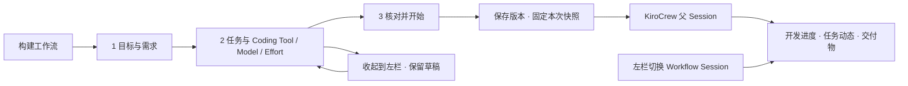
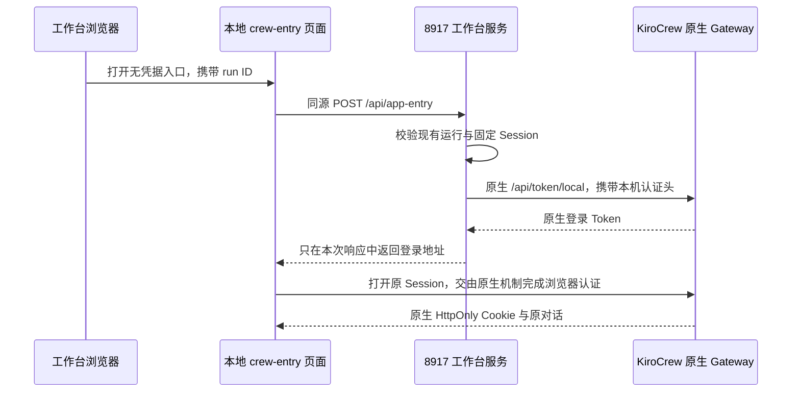
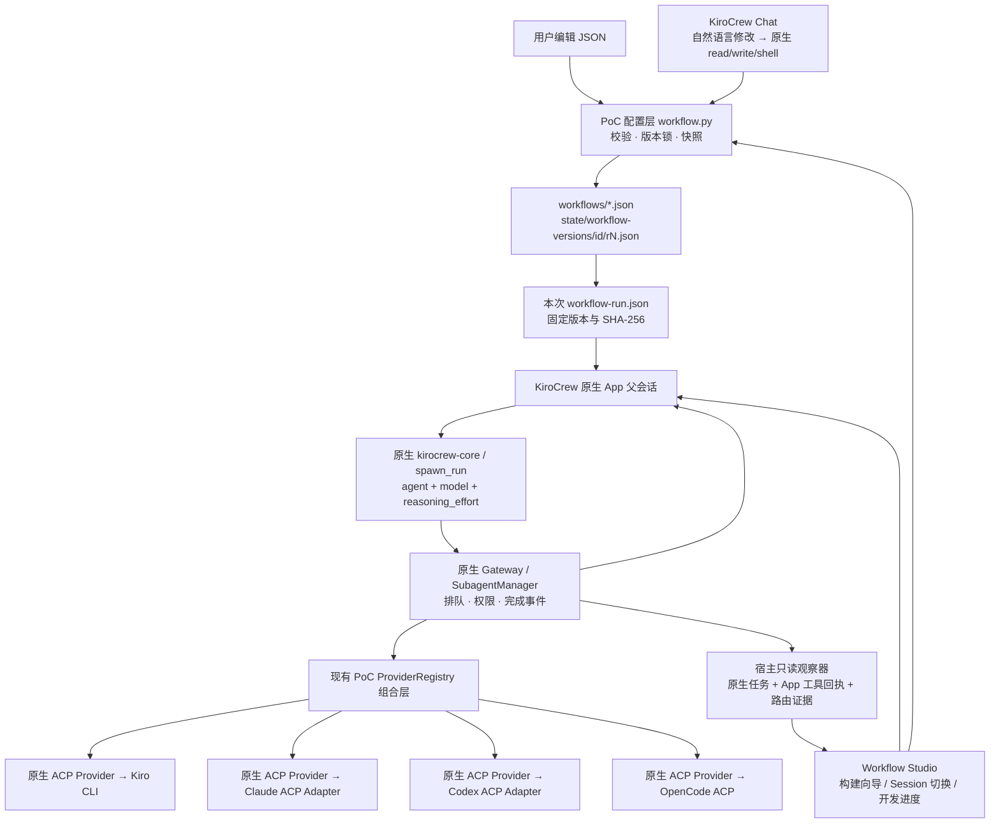
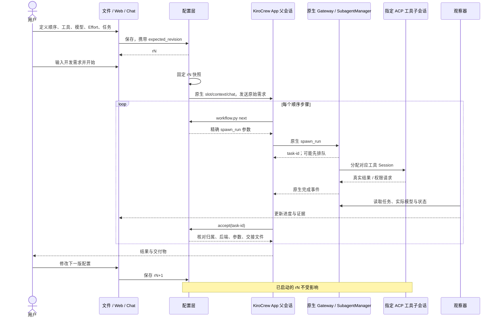

# 工作流界面与管理改进 · 2026-10-08

详细交互报告：[Workflow MVP HTML 原理详解](docs/workflow-mvp-report/index.html)。
包含 17 个章节、架构与时序 SVG、执行场景动画、版本 / 参数演示、源码快照和完整原文附录；
可离线阅读，动画仅用于说明机制。

公开基线见 [模块与调用链](docs/BASELINE.md)，包含独立架构、时序、Session/Context 图。
客户案例原始报告和运行记录保留在原本机 PoC，不随公开仓库分发。
本文描述现有 macOS 基线；EC2 与团队平台演进见 [迭代计划](PLAN.md)。

日常使用见 [操作指南](docs/OPERATIONS.md)。新增紧凑 Task 列表、按需 Session 管理、动态状态报告、左右栏拖拽与工作流重名校验。
本版保留现有文件持久化，没有迁移 SQLite 或重写历史 Sessions。

最新操作方式与实现说明见 [开发手册](docs/DEVELOPMENT-HANDBOOK.md)。
用户需求与重要设计决定见 [Feature 记录](docs/FEATURES-AND-DECISIONS.md)，
交付变化见 [Release Notes](docs/RELEASE-NOTES.md)。

工作台现按 **Workflow → Sessions → Tasks** 组织，向导合并为“目标 → 任务与 Agent → 确认”。
新增 Session 选择、原生导出与工作台归档；工作流可删除 / 恢复，历史版本和运行保留。
JSON / YAML / Markdown 导入为独立草稿；意图生成通过已有 KiroCrew Chat，由 Kiro CLI 输出可校验草稿。

以下保留前期 MVP 说明；界面操作以最新开发手册为准。

---

# KiroCrew Workflow MVP

用户在 KiroCrew 中提出任务、选择工作流，在每一步指定 Coding Tool、模型和 Effort。
计划、任务文件与实现由工作者生成。配置文件、Chat、Web 操作同一份定义。

当前运行固定使用创建时的版本；所有修改生成新版本，下次运行生效。这是本次确认的 MVP 行为。

## 打开与操作

双击 `Workflow Studio.command`，或在本目录执行：

```bash
python3 workflow_launch.py
```

本机页面：`http://127.0.0.1:8917/`。原 Pipeline 保留在 `8916`。
启动器复用现有 PoC Gateway，只重启自己的网页观察进程；不会删除或重置 Sessions。
若已有 Gateway 尚未加载本次 Codex Effort 桥接，启动器仅在聊天、任务、队列与授权都空闲时优雅重载它。
忙碌时保留所有工作，先提供配置编辑；空闲后重新打开启动器即可。也可运行 `python3 reload_gateway.py`。

源码交付使用 `python3 build_pipeline_kit.py` 生成的 `kirocrew-octopus-kit.zip`。
当前启动器仍适用于已支持的 macOS 环境；这不是 EC2 部署包。
它只打包代码、预设和说明，不包含凭据、历史 Sessions、Memory、运行产物或本机依赖。
其他机器仍须安装 KiroCrew 和所选工具，并完成各工具自己的认证；安装说明见 `PIPELINE.md`。

页面以蓝白为主。首次打开进入构建向导；构建后，以开发状态为主。
桌面向导按可用宽度展开（最大 940px），任务与 Agent 在同一页配置；窄屏自动适配。

1. **目标**：选择“从需求到 Web 交付”，或新建、复制工作流。输入本次开发需求，无需手写 Plan 或 Tasks 文件。
2. **任务与 Agent**：编辑任务说明、排序，选择 Kiro CLI、Claude Code、Codex 或 OpenCode 及其 Model / Effort。首版支持 1–8 步顺序执行。
3. **确认**：核对需求、任务顺序和配置版本。可以仅保存，也可以保存并开始开发。
4. 开始后向导自动收起，切换到本次 Session 的进度。通过“打开 KiroCrew”查看原生对话、处理工具权限请求。

“目标”提供四个示例模板：**Web 应用四工具交付、Bug 修复回归、双工具代码审查、Go API 与 Web 工作台**。
点击模板会复制出一份新工作流草稿，并带入任务与工具组合；已有工作流保持不变。
需求框为空时填入示例需求，有输入时保留用户原文。模板的模型默认使用 `auto`，
用户可以在 Agent 步骤中选择当前工具公布的具体模型和 Effort。
模板定义保存在 `ui/workflow-templates.json`，仍使用同一套 Workflow schema、保存和分派接口。

向导中的“收起到左侧”保留当前步骤、需求和配置草稿。左栏点击“编辑工作流”恢复；
刷新页面、切换历史 Session 都不会清空草稿。草稿保存在当前浏览器，只有明确保存才写入版本配置。
向导内切换工作流时，各个工作流的配置草稿分别保留；本次需求是整个向导共用的一份输入。

左栏管理 Workflow Sessions，可按工作流、状态或开发需求搜索、切换；每次明确开始的新任务创建独立 Session。
上方显示所选 Session 的整体进度，中间显示步骤、当前任务、动态与执行记录，右栏提供本次任务与下次配置视角。
整体百分比是“已交接任务数 / 总任务数”，不是模型内部生成进度。
运行中的 Model、Effort、Task ID 和工具 Session 以真实记录为准；未报告的信息明确标注为未报告。
“编辑需求并新建任务”从历史需求构建新的运行；编辑任务或 Agent 只影响下一版配置。

如果希望从 App 输入，在“目标”勾选“开始后，在 KiroCrew Chat 中输入需求”。
这条路径只准备普通 App 对话，用户可以直接描述需求，
也可以说“把 review 的 Effort 改成 medium，下次运行生效”。这个对话已经知道配置文件位置与版本命令，
无需用户手写计划或复制长提示词。

Chat 修改配置后，在向导“目标 → 文件导入、导出与 Chat 配置”中点击“重新加载已保存配置”。
有本地修改时，该按钮明确标为“放弃当前草稿，重新加载已保存配置”；后台轮询不会覆盖草稿。
首版每次新运行创建一条 App 对话；同一次运行的全部步骤与结果归属同一条父对话。
准备 App 会话时就固定版本。因此，在准备好的 Chat 中修改配置后，要从网页重新创建一次运行，
才会使用新版本；继续旧对话仍使用它原来的快照。



## 模型选择与交接核对

Claude Code 的模型候选来自 KiroCrew 的 `provider_models.json` 中 `claude_code` 命名空间；
Kiro CLI、Codex、OpenCode 分别读取自己的命名空间，不混用模型列表。
“刷新候选”重新读取这个本机缓存，不代表实时刷新云端账号权限；
新的候选由工具在原生 ACP 会话中公布，再由 KiroCrew 更新缓存。

当前安装的 KiroCrew 把启动模型视作继承配置：Claude ACP 拒绝一个 ID 后，可能继续使用工具默认模型。
Workflow 的明确选项有更严格的语义，因此在创建 Session、发送需求和每次 `next` 分派前，
检查 Claude 的明确模型是否在该工具公布的候选列表中。未公布时停止，不产生新任务。
`auto` / `default` 表示用户允许工具选择模型；未验证的可移植配置可以保存，但不能绕过本机运行前检查。

候选列表仍不是账号权限保证。组织策略、工具自身拒绝或运行中替换模型，仍可能导致实际值变化。
运行后的核对继续严格比较模型 ID，不把 Sonnet 当成 Opus，也不因代码测试通过就放行模型不匹配。
原生任务已返回、但交接校验未通过时，界面显示“交接未通过”，与“执行失败”分开。
“调整模型并新建运行”带入原需求、打开对应 Agent 配置；用户选择支持的模型，保存新版本后再开始。
历史运行快照、检查结果与产物保持原样。

## 打开 App 时的认证

工作台中的“打开 KiroCrew”和“在 KiroCrew 中处理”均通过同一个认证入口进入原 Session。
无须手工复制 Token 或编写 MCP 配置。



登录入口通过同源、Host 和请求头检查；从交付预览或其他站点不能调用此入口取得认证信息。
工作台不将 Token 写入工作流快照、配置、静态 HTML、自身的浏览器存储或交付报告；KiroCrew 管理自己的登录状态。
原生链接窗口最长 5 分钟，申请的浏览器 Session 生命周期为 8 小时；界面路由与认证参数由 KiroCrew 自身管理。
普通无认证的 `/chat?sid=...` 地址仍依赖浏览器已有的登录状态；从工作台入口打开会重新完成原生认证。

## 最小配置

`workflows/development.json` 是可编辑的定义。示例：

```json
{
  "schema": 1,
  "id": "my-workflow",
  "name": "编码与独立审查",
  "revision": 0,
  "steps": [
    {
      "id": "code",
      "name": "实现",
      "tool": "claude",
      "model": "global.anthropic.claude-sonnet-4-6",
      "effort": "medium",
      "prompt": "根据用户需求实现并运行测试，保存真实 diff。"
    },
    {
      "id": "review",
      "name": "审查",
      "tool": "codex",
      "model": "openai.gpt-6-astra",
      "effort": "high",
      "prompt": "读取真实 diff，实际运行测试并审查安全问题；不修改实现。"
    }
  ]
}
```

这些模型 ID 来自这台机器的缓存或实际运行，不代表其他账号具备相同权限。
使用 `auto` 可以交由后端选择模型，但此时不能设置非空 Effort。

首次导入：

```bash
python3 workflow.py save workflows/my-workflow.json --expected-revision 0
```

修改已保存的 r1：

```bash
python3 workflow.py save workflows/my-workflow.json --expected-revision 1
```

或精确修改一个步骤：

```bash
python3 workflow.py set my-workflow --step review \
  --model openai.gpt-6-astra --effort low --expected-revision 1
```

保存命令使用文件锁和乐观版本检查，防止 Chat 与网页互相覆盖。
改变工具时默认清除原工具的模型和 Effort；如果需要同时指定，请一并传入。
修改本地 JSON 后必须执行 save 导入，或通过网页导入并保存；没有后台文件自动监听。
`revision` 由保存命令分配，不靠手工递增。

## 分层与架构



| 层 | 已有实现 / 本次新增 | 职责 |
|---|---|---|
| App、Gateway、SubagentManager、ACP Provider | KiroCrew 原生 | 用户对话、原生 MCP 调度、队列、权限、工具会话 |
| `poc.py` ProviderRegistry | 前序 PoC 基础，本次补全 Codex 参数转换 | 模板映射到不同 ACP Backend；在工厂边界转换模型与 Effort |
| `workflow.py` | 本次新增 | JSON 校验、版本、运行快照、精确 spawn 参数、交接核对、观察 |
| `ui/workflow.*` | 本次新增 | Web 配置和运行展示 |
| `workflow_launch.py` | 本次新增 | 复用 Gateway，启动本地看板 |

这是建立在已完成 PoC 组合层之上的 MVP，不能表述为“安装原版 KiroCrew 后，仅写这个 JSON 即可获得全部 UI”。
客户使用交付的配置层即可，不需要编写 ACP Adapter 或新的 MCP 接口。
没有修改已安装 KiroCrew 的源码，也没有新增一个负责调用 LLM 的调度服务。

原生 HTTP 接口只用于：创建 slot、附加 context、发送 chat、读取任务与权限列表。
配置页的本地 HTTP 接口只读写配置、准备 App 入口和展示证据；不会调用 spawn API 或启动 Coding CLI。
真实分派由父 Agent 调用原生 MCP `spawn_run`。

## 一次运行的交互



## Session、Context 与 Memory

一个 Workflow Run 对应一个普通 App 父 Session。
每一步 `spawn_run(keep=true)` 由 KiroCrew 分配独立子 Session；工具还有自己的原生 Session ID。
看板把这两种 ID 分开显示。
原生 `spawn_continue` 可在同一个工具会话中补齐交付，但会分配新的任务 ID。
观察器根据 App 原生续作回执关联这两个任务，核对持久化的 Conversation 归属，再验收新任务。
旧核对记录保留在 `accepted/previous/`；空返回 `_No response._` 不能通过新核对。

上下文通过三部分传递：用户原始输入、前面步骤的真实返回结果、同一工作目录中的文件。
完整需求和阶段指令写入 `*-instructions.md`，完整原生返回写入 `*-result.txt`，
分派文本只包含摘要与文件路径，保持在原生 `spawn_run` 的 5,000 字符限制内。
工作者读取完整文件，不依赖被截断的历史。首版没有跨工具共享 KV Cache，
也没有把 Claude 的原生聊天历史转换成 Codex 历史。

本 MVP 固定 `include_memory=false`，因为每个任务已有明确输入，避免无关长期记忆干扰演示；
KiroCrew 原有 Memory 和历史 Sessions 都保留。其他原生项目/教训上下文使用 KiroCrew 默认处理。
`keep=true` 也不意味着永久保活，生命周期仍受 KiroCrew 原生保留策略约束。

## Tool、Model 与 Effort 的真实边界

| 选择 | 下传方式 | 如何核对 |
|---|---|---|
| Tool | JSON `tool` → 现有模板 `poc-*` → ProviderRegistry → 原生 ACP Backend | 路由日志中的 `actual_backend` |
| Model | 原生 `spawn_run(model=...)` → Session → Provider | `requested_model` 与 `resolved_model` |
| Effort 请求 | 原生 `spawn_run(reasoning_effort=...)` → `reasoning_effort_override` | App 原生工具事件中的实际请求参数 |
| Effort 实际值 | 由适配器和具体模型决定 | 仅在原生返回中确实出现时显示；缺失写“未报告” |

本机 KiroCrew 0.7.2 的 Claude/Codex 路径通过 ACP `session/set_config_option` 设置 Effort；
适配器可能不支持指定档位，或下降到较低档位。原生工厂接收了请求不等于模型侧一定采纳。
本机 Codex 会在部分 `resolved_model` 中返回 `[low]` 等后缀，可作为实际返回证据。
Claude 未持久化同等信息时保留“实际 Effort 未报告”，不拿模型自述证明参数生效。

实际联调还发现两个层次的约束：Codex 裸模型 ID 在原生启动时可能被折叠到默认的 `[xhigh]`，
使裸模型键上的 `low` 覆盖失效；但公开 `spawn_run` 的 schema 又不允许模型 ID 含方括号。
因此转换放在已有 `poc.py` 的 ProviderRegistry 工厂边界：

```text
用户配置 / 原生 spawn_run:
  model = openai.gpt-6-astra
  reasoning_effort = low
                 ↓ 原生参数校验通过
PoC ProviderRegistry:
  model_override = openai.gpt-6-astra[low]
  reasoning_effort_override = low
                 ↓
KiroCrew 原生 ACP Client:
  model 与 reasoning_effort 分别通过 session/set_config_option 设置
```

此处复用 KiroCrew 已实现的组合 ID 拆分逻辑，未修改 MCP schema 或安装包。
看板还会按该任务的真实 Codex Session ID，读取本机对应 `turn_context` 的
`model` / `effort` 元数据；如可用，它比仅从模型字符串后缀推断更直接。
第一次请求 low、实际 xhigh 的失败证据保留，不以“配置已发送”冒充生效。

空 Effort 表示不添加本次覆盖，继续使用 KiroCrew 的角色/默认设置和后端默认值。
界面的“后端默认”是这一继承模式，不承诺绕过 KiroCrew 已配置的角色默认值。

OpenCode 在当前 KiroCrew 集成中没有这条 Effort 下传路径，配置只允许后端默认。
没有把 `max` 当成所有工具都支持的通用值。模型下拉框是缓存候选，不是实时账号授权检查。
若实际模型与明确 pin 不一致，交接核对停止推进；观察到的 Effort 与请求不一致时也停止。

本机 OpenCode 的 `fs/write_text_file` 请求与当前 KiroCrew ACP Client 不兼容，原生日志会返回
`Method not found: fs/write_text_file`。因此 OpenCode 阶段指令使用它已有的 Bash/Shell 工具配合
Python 或 Node 在工作目录读写文件；这条路径仍走原生工具授权。Shell 被拒绝就停止，
不增加客户自定义 RPC，不绕过权限。这不代表当前集成已经支持全部 ACP 文件操作。

为什么这里没有直接执行 KiroCrew 原生 Workflow DSL：
本机 `workflows/runner.py` 接受 `ctx.agent(effort=...)`，
但 `workflows/agent_exec.py` 和 `workflows/agent_pool.py` 没有把它传给 `SessionManager.get_or_create()`。
首版使用参数链路完整的原生 `spawn_run`，复用此前已验证的 App/SubagentManager 方案。
原生 Workflow 的保存库、`/workflow` 和此处 PoC JSON 定义是不同存储，本 MVP 没有伪装成同一个原生库。

## 证据与 MVP 范围

每轮 `state/runs/workflow-*/` 保存：

- `workflow-run.json`：配置版本、快照与哈希。
- `input.json` / `workspace/REQUEST.md`：用户原始需求。
- `dispatch-*.json`：期望调用参数；它本身不证明任务已执行。
- `workflow-live.json` / `workflow-report.json`：原生观察结果与参数对照。
- `accepted/*.json`：真实 task-id、后端、模型、原生 Effort 请求和交接文件哈希。
- `workspace/*-handoff.md`：工作者交接。
- `workspace/*-instructions.md` / `*-result.txt`：完整指令与已核对的原生返回。

原生 `spawn_run` 已返回 ID、但子任务还在排队时，`/api/spawn` 可能尚未列出它。
看板读取本次 App JSONL 中的工具回执显示“已接收，等待执行”，不会伪造“运行中”或推测后端。

当前执行控制依赖父 Agent 按协议调用 `next → spawn_run → accept`，不是一个强制 DAG 引擎。
核对可以阻止错误交接被标为成功，但无法阻止一个不遵循指令的 Agent 提前调用工具。
首版核对失败停止；配置层没有自动重试策略、分支、并行、运行中热改步骤、跨机器迁移或发布部署。
父 Agent 可以在 App 中通过原生 `spawn_continue` 补齐尚未交接的步骤，仍需核对新任务后才能继续。
“已交接”不是自动质量认证；安全审查与测试仍以真实产物和结果为准。

生成的网页放在 `localhost:8917` 预览，配置页在 `127.0.0.1:8917`。
浏览器源隔离，预览域不能访问本服务的配置和任务提交接口。
当前是可信本机 PoC，不是多用户远程托管服务。

验证命令：

```bash
python3 -m unittest test_workflow test_pipeline test_reload_gateway -q
/Applications/KiroCrew.app/Contents/Resources/backend-dist/kirocrew-backend-arm64/bin/python3.12 -m unittest test_routing -q
node --check ui/workflow.js
```
